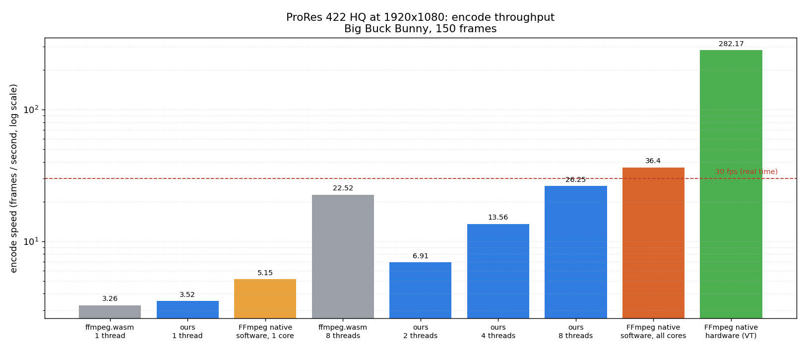
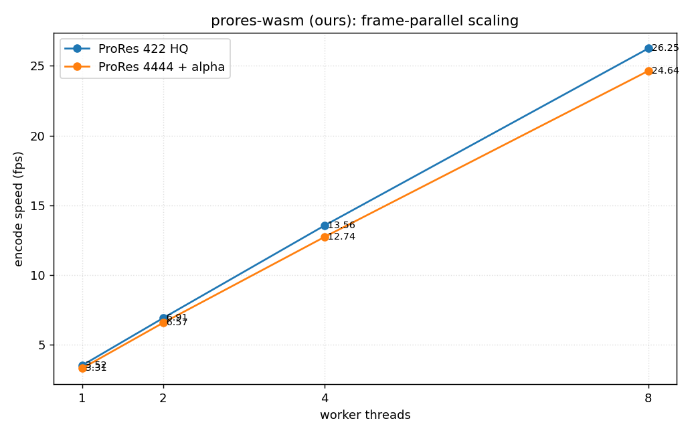

# ProRes encoder benchmark

Measures ProRes encode throughput (frames per second) for three encoders:

- **prores-wasm-encoder** (this library), single thread and with the worker pool
- **ffmpeg.wasm**, single thread and multi thread
- **Native FFmpeg**, software and VideoToolbox hardware

Tested at 1080p ProRes 422 HQ and ProRes 4444 with alpha.

Footage is the first 5 seconds of Big Buck Bunny (1920x1080, 30 fps, so 150
frames), decoded once to raw RGBA. Every encoder receives the exact same pixels,
so the numbers reflect encoding only, with no H.264 decode or scaling included.
The 4444 runs add a synthetic moving alpha matte.

## Contenders

| Encoder | How it ran |
|---|---|
| prores-wasm (ours) | our WASM encoder: single thread, plus a 2, 4, and 8 worker pool |
| ffmpeg.wasm | FFmpeg in WASM: single thread (`@ffmpeg/core`) and 8 thread (`@ffmpeg/core-mt`, browser only) |
| FFmpeg native | the desktop `ffmpeg` binary: software on 1 core, software on all cores, and VideoToolbox hardware |

Two points that are easy to misread:

- ours and ffmpeg.wasm are the same wasm binaries run two ways, under Node and
  in a Chromium tab. Both use V8, and the two sets of numbers agree. There is no
  native C build of our encoder in this benchmark. ffmpeg.wasm's multi thread
  build only runs in a browser, so that number comes from the tab.
- FFmpeg native is the real desktop CLI, included as a reference. It is not
  ffmpeg.wasm. "Software" runs on the CPU; "hardware" uses the chip's dedicated
  ProRes engine (VideoToolbox on Apple silicon).

## Results



The worker pool's scaling with core count:



Full numbers for both profiles:

<!-- RESULTS:START -->
### ProRes 422 HQ at 1920x1080

| Encoder | fps | Real time | Encode time |
|---|--:|--:|--:|
| ffmpeg.wasm, 1 thread (WASM) | 3.26 | 0.11x | 46.0s |
| ffmpeg.wasm, 8 threads (WASM, browser) | 22.52 | 0.75x | 1.3s |
| prores-wasm (ours), 1 thread (WASM) | 3.52 | 0.12x | 42.6s |
| prores-wasm (ours), 2 threads (WASM) | 6.91 | 0.23x | 21.7s |
| prores-wasm (ours), 4 threads (WASM) | 13.56 | 0.45x | 11.1s |
| prores-wasm (ours), 8 threads (WASM) | 26.25 | 0.87x | 5.7s |
| FFmpeg native, software, 1 core | 5.15 | 0.17x | 29.1s |
| FFmpeg native, software, all cores | 36.4 | 1.21x | 4.1s |
| FFmpeg native, hardware (VideoToolbox) | 282.17 | 9.41x | 0.5s |

### ProRes 4444 with alpha at 1920x1080

| Encoder | fps | Real time | Encode time |
|---|--:|--:|--:|
| ffmpeg.wasm, 1 thread (WASM) | 3.02 | 0.1x | 49.7s |
| ffmpeg.wasm, 8 threads (WASM, browser) | 18.29 | 0.61x | 1.6s |
| prores-wasm (ours), 1 thread (WASM) | 3.31 | 0.11x | 45.4s |
| prores-wasm (ours), 2 threads (WASM) | 6.57 | 0.22x | 22.8s |
| prores-wasm (ours), 4 threads (WASM) | 12.74 | 0.42x | 11.8s |
| prores-wasm (ours), 8 threads (WASM) | 24.64 | 0.82x | 6.1s |
| FFmpeg native, software, 1 core | 4.65 | 0.16x | 32.2s |
| FFmpeg native, software, all cores | 34.15 | 1.14x | 4.4s |
| FFmpeg native, hardware (VideoToolbox) | 270.27 | 9.01x | 0.6s |

### Browser run

The WASM encoders were also run in a Chromium tab, both to measure ffmpeg.wasm multi thread (which only runs in a browser) and to check the Node numbers. They agree within a few percent.

| Encoder | 422 HQ fps | 4444 fps |
|---|--:|--:|
| ffmpeg.wasm, 1 thread (WASM, browser) | 3.23 | 2.95 |
| prores-wasm (ours), 1 thread (WASM, browser) | 3.57 | 3.24 |
| ffmpeg.wasm, 8 threads (WASM, browser) | 22.52 | 18.29 |
| prores-wasm (ours), 8 threads (WASM, browser) | 24.68 | 23.2 |

_Machine: Apple M1 Pro, 10 cores. Node v26.4.0. ffmpeg version 8.1.2._
<!-- RESULTS:END -->

## Layout

```
benchmark/
  prepare-footage.mjs     BBB mp4 to footage/frames_1080p.rgba  (+ meta.json)
  bench-common.mjs        footage loading, stats, result rows
  bench-ours.mjs          our library: single thread + worker pool
  ours-worker.mjs         worker_threads body for the pool bench
  bench-ffmpegwasm.mjs    ffmpeg.wasm single thread (Node)
  bench-native.mjs        native ffmpeg: software 1 core / all cores / VideoToolbox
  run-all.mjs             runs everything, writes results/results.{json,csv}
  summarize.mjs           builds the tables in this README from results/
  plot.py                 matplotlib charts from results/
  browser/                in browser harness (serve.mjs + bench.html/js + ffworker.js)
  results/                results.csv, results.json, chart_*.png
```

## Running

Prerequisites: native `ffmpeg` (built with `--enable-videotoolbox`), Python 3
with matplotlib, and `npm install` inside `benchmark/`.

```bash
cd benchmark
npm install
npm run footage                        # downloads BBB, decodes to raw frames (~1.2 GB, gitignored)

node --no-warnings run-all.mjs         # full Node run (~15 min)
node --no-warnings run-all.mjs --quick # smoke run (1 rep, 8 workers only)

node summarize.mjs                     # refresh the tables above
python3 plot.py                        # charts to results/
```

VideoToolbox needs the macOS command sandbox off, because the sandbox blocks the
system encoder service. Run the native part with sandboxing disabled.

Browser harness (for ffmpeg.wasm multi thread and the in browser cross check):

```bash
node browser/serve.mjs   # http://localhost:3210 with COOP/COEP headers
# open the page, click Run benchmark, then Download CSV
# query params: ?frames=30&reps=1&workers=8&threads=8&auto=1
```
